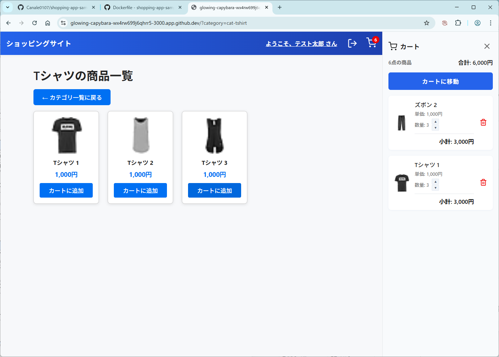
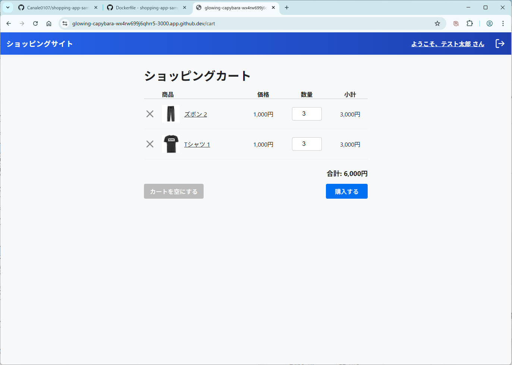
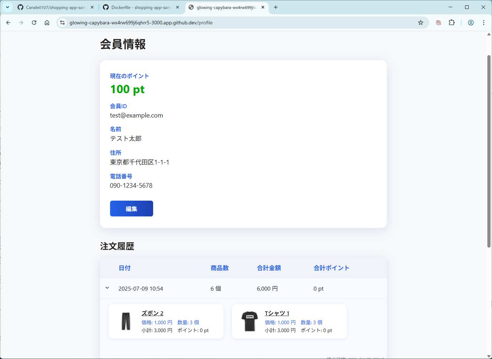

# ショッピングサイト サンプル（Next.js + Prisma + PostgreSQL）

## 実際の画面

### 商品検索結果画面



### ショッピングカート画面



### 会員情報照会画面



## 前提条件

- Docker & Docker Compose
- git

## セットアップ手順（初回）

1. リポジトリをクローン

   ```sh
   git clone <このリポジトリのURL>
   cd shopping
   ```

2. `.env`ファイルの作成

   - `.envsample` をコピーして `.env` を作成し、必要に応じて編集してください。

   ```sh
   cp .envsample .env
   ```

   - `DATABASE_URL`：PostgreSQL の接続情報を自分の環境に合わせて設定
   - `NEXTAUTH_SECRET`：本番運用時は `openssl rand -base64 32` などで生成した 32 文字以上のランダムな値を推奨

3. Docker Compose で起動

   ```sh
   docker compose up -d
   ```

   - このコマンドで PostgreSQL と Next.js アプリケーションが同時に起動します
   - 初回起動時に、entrypoint.sh により自動でマイグレーションとシードデータの投入が実行されます。この処理は Dockerfile に組み込まれており、特別な操作は不要です。

4. ブラウザで [http://localhost:3000](http://localhost:3000) にアクセス

> **注意**: このプロジェクトは Docker Compose での運用を前提としています。
>
> - Prisma Client の生成は Docker ビルド時に自動で実行されます
> - データベースのマイグレーションとシード投入は、entrypoint.sh により初回起動時に自動実行されます
> - このスクリプトは PostgreSQL の起動を待機してから処理を開始するため、安定して初期化されます
> - アプリケーションは `npm run dev` で起動し、ホットリロードに対応しています

---

## 概要

このプロジェクトは、Next.js（TypeScript）・Prisma・PostgreSQL・NextAuth.js を使ったモダンなショッピングサイトのサンプルです。

- 商品検索・カテゴリ絞り込み
- 会員登録・ログイン/ログアウト
- 会員情報照会（注文履歴・ポイント表示）
- 注文履歴の表形式表示
- Docker Compose による DB・アプリの一括起動

---

## ダミーユーザー情報

- 会員 ID: `test@example.com`
- パスワード: `password123`

---

## 主な機能

- トップ画面：商品一覧＋カテゴリ検索
- ログイン/ログアウト（ヘッダーから）
- 会員情報照会（ポイント・注文履歴・会員情報）
- 注文履歴：日付、商品 ID、商品名、価格、数量、金額、ポイントを表形式で表示

---

## 技術スタック

- Next.js (TypeScript)
- Prisma ORM
- PostgreSQL
- NextAuth.js
- Docker Compose

---

## 開発 Tips

- Prisma Studio で DB を GUI 管理：
  ```sh
  docker compose exec app npx prisma studio --port 5555
  ```
  ブラウザで http://localhost:5555 にアクセス
- スキーマ変更時：
  ```sh
  docker compose exec app npx prisma migrate dev --name <migration名>
  docker compose exec app npx prisma generate
  ```
- ダミーデータ再投入：
  ```sh
  docker compose exec app npx tsx prisma/seed.ts
  ```

---

## 登録ユーザーの確認

登録されている会員（ユーザー）情報を確認したい場合は、Prisma Studio を利用するのが便利です。

1. プロジェクトルートで以下のコマンドを実行してください。
   ```sh
   docker compose exec app npx prisma studio --port 5555
   ```
2. ブラウザで http://localhost:5555 にアクセス

---

## ファッション MNIST 画像生成（Python）

`fashion_mnist_to_products.py` を使ってファッション MNIST 画像をカテゴリごとに保存できます。

### 仮想環境の作成とパッケージインストール

1. プロジェクトルートで以下を実行し、Python 仮想環境を作成・有効化します。

   ```sh
   python3 -m venv .venv
   source .venv/bin/activate
   ```

2. 必要なパッケージをインストールします。

   ```sh
   pip install --upgrade pip
   pip install tensorflow pillow
   ```

### スクリプトの実行

仮想環境が有効な状態で、以下のコマンドを実行してください。

```sh
python fashion_mnist_to_products.py
```

実行後、`public/images/products` ディレクトリに各カテゴリ 15 枚ずつ画像が保存されます。
